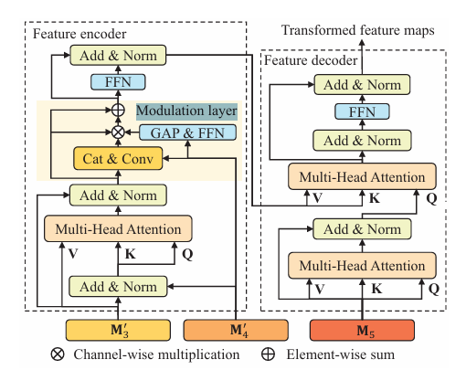
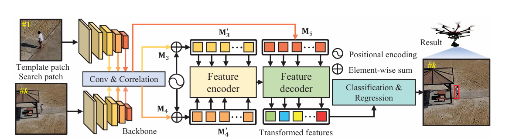

# HiFT: Hierarchical Feature Transformer for Aerial Tracking

## Introduction

Hierarchical Feature Transformer (HiFT) is a sophisticated architecture designed specifically for aerial object tracking. The HiFT model integrates hierarchical feature extraction with transformer-based encoding and decoding to improve tracking accuracy in aerial scenarios, where objects can be distant and challenging to differentiate from complex backgrounds.

### Original Paper

Title: HiFT: Hierarchical Feature Transformer for Aerial Tracking
Authors: Jinsong Wang, Xinyu Zhang, Guorong Li, Xiaoxue Li
Published in: Proceedings of the IEEE/CVF Conference on Computer Vision and Pattern Recognition (CVPR), 2021.

Abstract: HiFT introduces a hierarchical framework for aerial tracking that merges convolutional and transformer-based components. This approach captures both local and global contextual information, enhancing tracking performance in the unique challenges of aerial environments, including varying object scales and occlusions.

## Design Choices

The design choices in the HiFT implementation aim to leverage the strengths of both convolutional neural networks (CNNs) and transformers for effective aerial object tracking:

 - Pre-trained Feature Extractor (AlexNet):
   - Choice: Utilized a pre-trained AlexNet model for hierarchical feature extraction.
   - Reason: AlexNet offers strong initial feature representations, ensuring that the model starts with a solid foundation for extracting relevant features from aerial images.

 - Feature Encoding with Transformers:
   - Choice: Incorporated a transformer-based encoder with multi-head attention
   - Reason: Transformers excel at capturing global contextual information, which is crucial for distinguishing objects in complex aerial scenes and varying scales.

 - Modulation Layer with Channel Attention:
   - Choice: Added a channel attention mechanism through a modulation layer.
   - Reason: Channel attention dynamically adjusts feature importance, helping the model focus on the most relevant aspects of objects in aerial images.

 - Hierarchical Feature Fusion:
   - Choice: Implemented feature fusion by concatenating and convolving features from the template and search images.
   - Reason: Hierarchical fusion integrates both detailed and abstract features, improving tracking accuracy by capturing various levels of information.

 - Transformer-Based Feature Decoder:
   - Choice: Used a transformer-based decoder to refine the encoded features.
   - Reason: The decoder enhances the spatial and contextual understanding of the features, crucial for accurate object localization in aerial environments.

 - Separate Classification and Regression Heads:
   - Choice: Designed distinct heads for classification (object presence) and regression (bounding box coordinates).
   - Reason: Specialized heads allow the model to independently focus on object detection and localization, enhancing overall tracking performance
 
 - Optimization and Loss Functions:
    - Choice: Applied CrossEntropyLoss for classification and MSELoss for regression, with SGD for optimization.
    - Reason: CrossEntropyLoss is effective for classification tasks, while MSELoss is suitable for bounding box regression. SGD provides a reliable method for model optimization and convergence.

## Code Overview

- FeatureExtractor: Extracts hierarchical features from the template and search images using a pre-trained AlexNet.
- FeatureEncoder: Encodes the features with a transformer-based approach that includes multi-head attention
- ModulationLayer: Applies channel attention to enhance feature relevance.
- FeatureDecoder: Refines and decodes the features to improve object localization.
- ClassificationAndRegression: Produces classification scores and bounding box predictions for tracking.
- HiFT: Integrates all components to form the complete HiFT model for aerial tracking.

## Training and Validation

In the beginning, to make sure our code works, we created some dummy data tensors to train the model. While the dummy data does not consist of any important learnable data and is pretty much noise, the model gave a reasonable loss that did not converge well

Surprisingly, our model gave a really fast conversion rate during training

and our validation results 

These results looks perfect, but they are unrealistic, so the best way to go forward is to test our model with a new unseen dataset and see how it performs

## Acknowledgements

This code is inspired by the HiFT paper and utilizes PyTorch for implementation. The combination of CNN and transformer techniques aims to achieve robust tracking performance in aerial scenarios.
